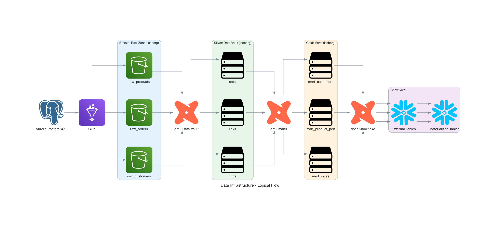
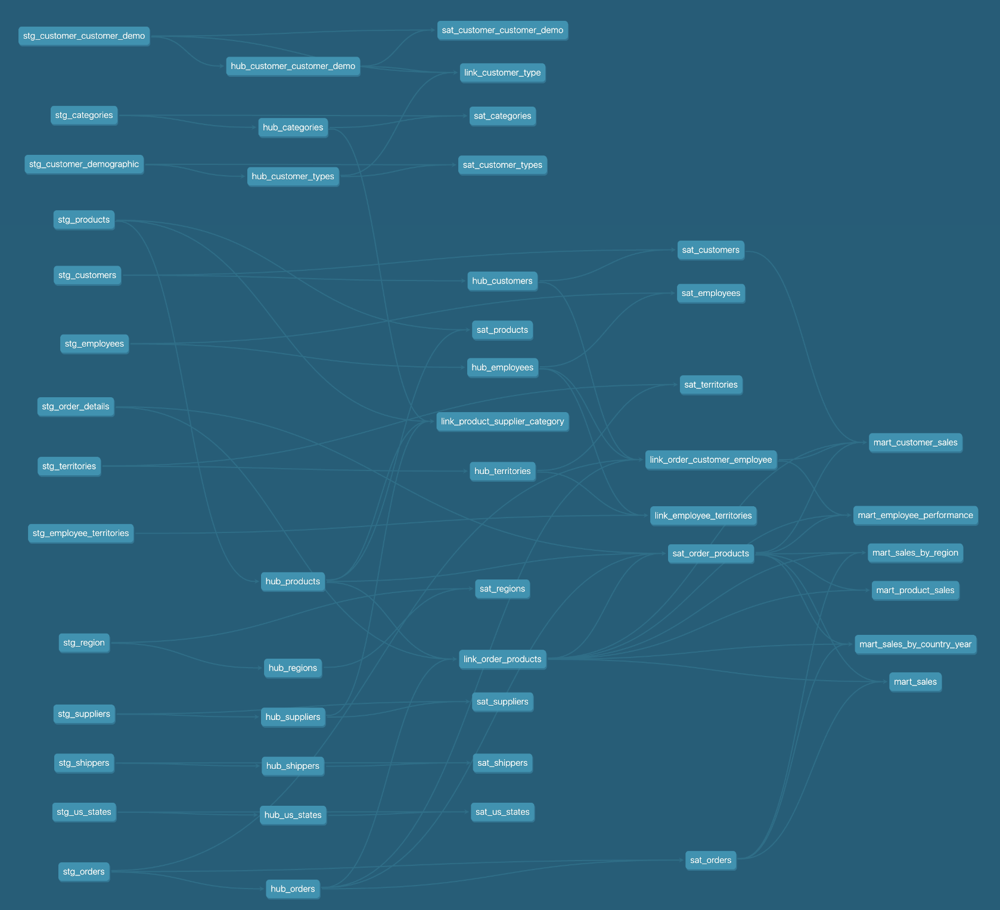

# Data Vault Analytics Platform with AWS Glue, Iceberg, and dbt
## Purpose of the Project

This project builds a modern, scalable data warehouse architecture using:
- AWS Aurora Serverless for transactional data storage as the source system
- AWS Glue & Iceberg for robust, ACID-compliant data lake storage
- dbt for implementing Data Vault 2.0 modeling
- Snowflake for data warehousing and analytics
- Amazon Athena as the query engine
- OpenTofu/Terragrunt for infrastructure provisioning

The goal is to demonstrate how to build a production-grade, cloud-native analytical platform for batch data processing
and historical tracking using open standards and managed AWS services.

---
## Architecture Overview


---
## 🔧 Infrastructure Setup and Tools

### 📦 Tools You’ll Need

Make sure you have the following software installed:

- [Python 3.13](https://www.python.org/downloads/)
- [uv](https://docs.astral.sh/uv/) - a Python package manager
- [AWS CLI](https://docs.aws.amazon.com/cli/latest/userguide/install-cliv2.html)
- [**tenv**](https://github.com/tofuutils/tenv) – A CLI tool to easily install and manage versions of:
  - [**OpenTofu**](https://opentofu.org/) – a community-driven, open-source alternative to Terraform (**recommended** ✅)
  - [**Terraform**](https://developer.hashicorp.com/terraform) – legacy option still widely used
  - [**Terragrunt**](https://terragrunt.gruntwork.io/) – a thin wrapper for managing Terraform/OpenTofu configurations
- [dbt CLI](https://docs.getdbt.com/) - this will be installed via `uv` in one of the next steps

### 🛠️ Prerequisites

Prior to running the project, ensure you have the following things configured:

- A working AWS account with sufficient permissions (IAM, VPC, Glue, RDS, etc.)
- A working Snowflake account (for data warehousing)
- AWS and Snowflake accounts should be configured so AWS can give the Snowflake account access to the S3 bucket.
Under [this link](https://docs.snowflake.com/en/user-guide/tables-iceberg-configure-external-volume-s3) you can find a
detailed guide on how to do this. **Keep in mind that the IAM role for the Snowflake account is a part of the infrastructure,
thus this step can be configured later**
- In order to access the Snowflake account, `dbt` uses the SSH key authentication method. Under
[this link](https://docs.snowflake.com/en/user-guide/key-pair-auth) you can find a detailed guide on how to set this up.
- Sensitive information (e.g., AWS credentials, Snowflake private key) should be stored in environment variables.
E.g. in an `.env` file. For this project, the following environment variables are required:
```bash
ATHENA_STAGING_DIR="a staging directory for Athena query results (and iceberg tables afterwards)"
SNOWFLAKE_EXTERNAL_ID="a unique identifier for Snowflake to access the S3 bucket"
SNOWFLAKE_ACCOUNT_ARN="an ARN of the Snowflake account that will access the S3 bucket"
SNOWFLAKE_ORGANIZATION_NAME="a Snowflake organization name"
SNOWFLAKE_ACCOUNT_NAME="a Snowflake account name"
SNOWFLAKE_USER="a Snowflake user name"
SNOWFLAKE_ROLE="a Snowflake role name"
SNOWFLAKE_PRIVATE_KEY="a path to the Snowflake private SSH key"
```

🧭 **Region:** This project is configured for the `eu-central-1` region by default.
🏗️ **Environment:** All Terragrunt modules are structured per environment (e.g., `dev`, `prod`), and the working example uses `dev`.

---

### 🛠️ Infrastructure Overview

This project provisions the following infrastructure using OpenTofu/Terraform + Terragrunt:

#### AWS
- **VPC with Public & Private Subnets**
  - Provides network isolation and control over traffic routing.

- **NAT Gateway + VPC Endpoints**
  - Ensures secure, private connectivity to AWS services (Glue, S3, Secrets Manager, etc.) from private subnets.

- **Aurora PostgreSQL Cluster**
  - Acts as the operational source database for ingestion.

- **S3 Buckets**
  - Iceberg table storage
  - Athena query results
  - Glue ETL scripts

- **AWS Glue Jobs**
  - Responsible for transforming and exporting data from Aurora to Iceberg tables.
  - Glue version: `4.0`
  - Worker type: `G.1X`
  - Number of workers: `2`
  - Script stored in S3
  - Integrated with Secrets Manager and Data Catalog

- **Glue Data Catalog**
  - Configured to manage Apache Iceberg tables (partitioned, versioned, and incremental).

- **IAM Roles and Policies**
  - Fine-grained access for Glue, S3, Secrets Manager, and other services.

#### Snowflake
- **Snowflake Database**
  - Data warehouse for analytics and reporting.
- **Snowflake Warehouse**
  - Compute resources for running queries.
- **Snowflake Roles and Permissions**
  - Roles for data ingestion, transformation, and querying.

---

### 🚀 Deploying the Infrastructure

To spin up the infrastructure, use the commands from the Makefile in the root directory of the repository:
```bash

make aws-init
make aws-plan
make aws-apply

make snowflake-init
make snowflake-plan
make snowflake-apply
```

---
### 💾 State Management & Best Practices
- Terraform State:
  - Stored remotely using S3 and DynamoDB to enable team collaboration and avoid state conflicts.
  (You can customize this if you use a different backend setup.)
- Cost Control Tips:
  - Services like AWS Glue, Aurora, and NAT Gateway can be costly.
  E.g., notice that VPC Endpoints in `terraform/vpc.tf` are commented out to destroy them when not used, to save costs.
  - Use Aurora Serverless v2, minimal worker types for Glue, and enable auto-pause where possible.
  - Clean up dev/test environments when idle to avoid unexpected charges.
- Infrastructure Change Workflow:
  - Always preview changes before applying `aws-plan|snowflake-plan`.

---
## Loading Data into Aurora PostgreSQL
- This is a one-time setup to load sample data into the Aurora PostgreSQL database, therefore, it is done manually directly from the AWS console:
  - Navigate to the RDS Console
  - Go to Query Editor, select the Aurora PostgreSQL instance, the secret from Secrets Manager, and connect.
  - Use the SQL query from https://github.com/pthom/northwind_psql/blob/master/northwind.sql
  - Verify that the data is loaded successfully.

### 📊 Data Source: Northwind Database
- The Northwind database is a sample database used for learning SQL and data warehousing concepts.
- It contains tables for customers, orders, products, and other entities typically found in a transactional system.
- Below is a diagram of the Northwind database schema:

---
## 🔁 ETL Pipeline: Extract, Transform, Load

This project uses **AWS Glue** and **Apache Iceberg** to extract data from an **Aurora PostgreSQL** database and store it in an Iceberg-based data lake on **S3**.

### 📦 ETL Flow Summary

1. **Extract**:
   AWS Glue connects to the Aurora PostgreSQL instance using JDBC. Secrets are securely retrieved from AWS Secrets Manager.

2. **Transform**:
   Glue reads data using Spark and applies any lightweight transformations if needed.

3. **Load**:
   Data is written into Iceberg tables stored in S3, with metadata tracked in the AWS Glue Data Catalog.

---

### 🚀 Running the ETL Job

Once your infrastructure and source DB are set up, you can trigger the ETL job manually from the AWS Console or via CLI:

```bash
aws glue start-job-run --job-name northwind-iceberg-aurora-to-s3-etl-dev
```

Remember to use the AWS CLI profile that has access to the Glue job and S3 bucket.

---
## 🧱 Data Modeling with dbt:  Data Vault 2.0 and Marts

Once raw data from Aurora is loaded into S3 Iceberg tables, **dbt** is used to transform it into a well-modeled Data Vault structure
and create marts afterward. While `marts` are not part of the Data Vault, they are built on top of it for analytical purposes;
thus, for this project's sake, they are included in the same dbt project and included in this section.

### 📐 Data Vault Components

This project uses standard Data Vault layers:

- **Hubs** – core business entities (e.g., customers, products)
- **Links** – relationships between hubs (e.g., order items link customers and products)
- **Satellites** – descriptive attributes and historical data for hubs and links

---
### 🛠️ How It's Structured

- **`models/staging/`**: Source staging models (`stg_*`) loaded from raw Iceberg tables
- **`models/data_vault/hub_*.sql`**: Hubs with business keys and surrogate keys
- **`models/data_vault/link_*.sql`**: Links joining two or more hubs
- **`models/data_vault/sat_*.sql`**: Satellites with historical attributes and hashdiffs
- **`models/marts/`**: Data marts built on top of the vault

---
### 🧠 Data Vault Features Implemented

- **Incremental materializations** – Improve performance and reduce cost by only processing new or changed records.
- **Hashdiff tracking in satellites** – Enables Slowly Changing Dimension (SCD) Type 2 behavior by tracking historical changes.
- **Surrogate keys** – Simplify joins, enable deduplication, and enforce uniqueness across hubs, links, and satellites.

`dbt_utils.generate_surrogate_key()` is used for consistency in hash-based keys and change detection.

### 🧠️ Data Vault Features To Be Implemented
- **Partitioning in Iceberg** – For optimizing query performance and storage.

---
### 📊 Data Vault Model Diagram

---
### 🧪 Running dbt
Before running dbt, ensure you have Python dependencies installed. Use the `uv` environment to manage Python packages:
```bash
cd root_repo_directory
uv venv .venv
source .venv/bin/activate
uv pip install -r requirements.txt # without developer packages
# OR
uv pip install -r requirements-dev.txt # with developer packages
```
Then, set up your dbt profile. Update the `./northwind_dbt/dbt/profile.yml` file with the following content:

```yaml
dbt_aws_profile:
  target: dev
  outputs:
    dev:
      type: athena
      s3_staging_dir: "{{ env_var('ATHENA_STAGING_DIR') }}"
      region_name: eu-central-1
      database: awsdatacatalog # can be any name, but must match the Glue Data Catalog database
      schema: northwind_data_vault
      work_group: primary
      profile_name: aws_iam_user_name

dbt_snowflake_profile:
  target: dev
  outputs:
    dev:
      type: snowflake
      account: "{{ env_var('SNOWFLAKE_ORGANIZATION_NAME') }}-{{ env_var('SNOWFLAKE_ACCOUNT_NAME') }}"
      user: "{{ env_var('SNOWFLAKE_USER') }}"
      role: "{{ env_var('SNOWFLAKE_ROLE') }}"
      authenticator: snowflake_jwt
      private_key_path: "{{ env_var('SNOWFLAKE_PRIVATE_KEY') }}"
      database: NORTHWIND_DB_DEV
      warehouse: NORTHWIND_WH_DEV
      schema: NORTHWIND_SCHEMA_DEV
```

Install dbt dependencies and run the models:

```bash
dbt deps        # installs dbt_utils
dbt seed        # optional, if seeds are defined
dbt run         # builds all models
dbt run --full-refresh   # full rebuild (use carefully)
dbt docs generate        # generate documentation
dbt docs serve           # view documentation
```

For the convenience of running dbt commands, you can use the Makefile in the root directory:
```bash
make aws-dbt # runs dbt on AWS Athena to build the models (data vault and marts)
make snowflake-dbt # migrates marts to Snowflake (creates external and materialized tables)
```


---
## Future Enhancements & Roadmap

## ✅ Testing & Quality Assurance

The aim is to ensure data accuracy, consistency, and reliability through the following measures:

- **dbt Tests**
  - `unique` and `not_null` tests on hub primary keys and link composite keys
  - `accepted_values` for enums (e.g. order status)
- **Potential improvements**
  - Add row count checks across layers (raw → vault)
  - Validate foreign key relationships between hubs, links, and satellites

---
## ⚙️ Deployment & Automation

Currently, this project is executed manually, but it’s designed with automation-readiness in mind.

- **Manual Flow**
  - OpenTofu/Terraform/Terragrunt for infrastructure
  - AWS Glue console for ETL
  - `dbt run` for transformations
  - `dbt docs generate` for documentation
- **Future Automation Ideas**
  - **Orchestration** via:
    - AWS CodePipeline
    - AWS ECS Fargate
  - **Triggering ETL** on schedule or based on data arrival


---
## 🌱 Roadmap

Here's what could be explored next:

- [ ] **Point-In-Time (PIT) Tables** for snapshot-style historical joins
- [ ] **Bridge Tables** for many-to-many relationships (e.g. products in orders)
- [ ] **Automated data loading** into Aurora via CDC or batch ingestion
